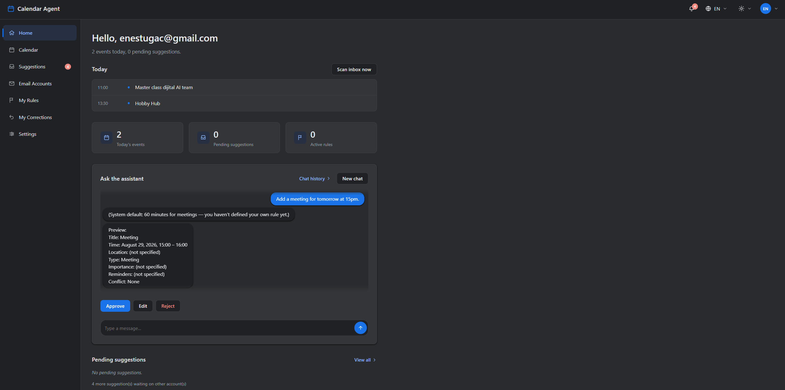
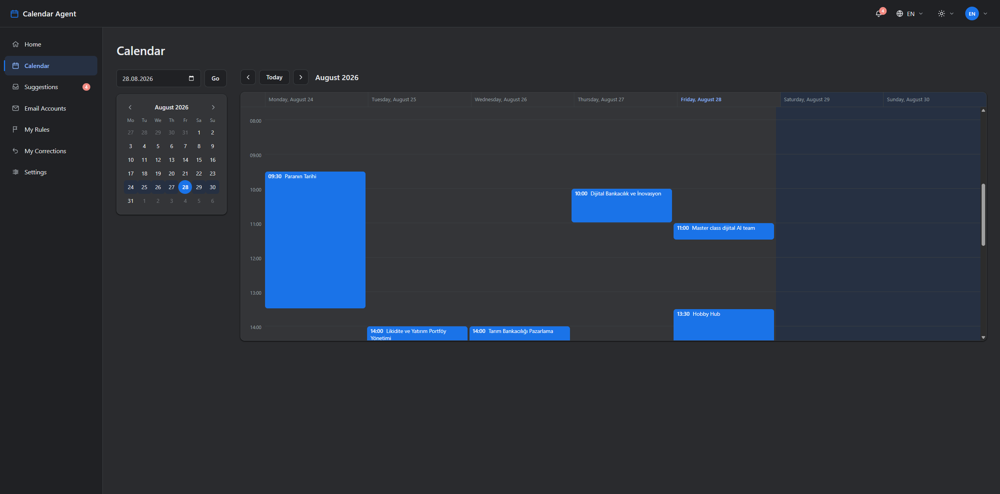
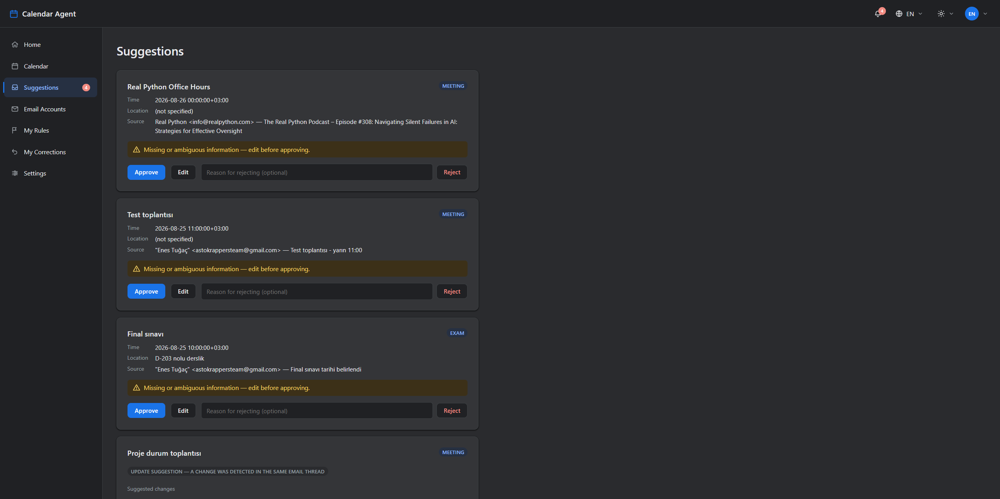
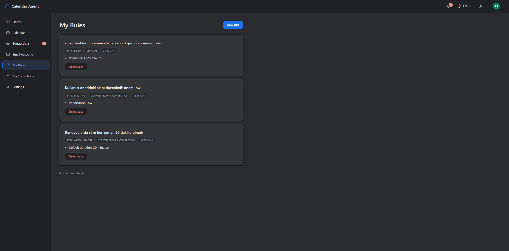

# Calendar Agent

A RAG-powered, multilingual (TR/EN), personalizable email and calendar assistant. Runs on a fully local/offline LLM via Microsoft Foundry Local — by default, email/calendar content never leaves the machine or reaches a cloud LLM API (an optional Gemini API integration exists, see below). You talk to it in natural language to create calendar events, define your own rules, and scan Gmail/Outlook for calendar-worthy content shown as suggestions — **no calendar write ever happens without explicit user confirmation.**

For the full architecture, data model, and design decisions, see **[docs/architecture-plan.md](docs/architecture-plan.md)**.
For project history, current implementation status, and lessons learned from live testing, see **[CLAUDE.md](CLAUDE.md)**.

## Screenshots

<table>
<tr>
<td width="50%"><br/><sub>Home — today's events, pending suggestions, and the chat assistant</sub></td>
<td width="50%"><br/><sub>Calendar — weekly hourly grid view</sub></td>
</tr>
<tr>
<td width="50%"><br/><sub>Suggestions — calendar-worthy content extracted from email</sub></td>
<td width="50%"><br/><sub>My Rules — personal rules defined in natural language</sub></td>
</tr>
</table>

## What it does (currently)

- **Web UI** (`python -m src.ui.app`) — Home, Calendar (weekly hourly grid), Suggestions, My Rules, My Corrections, Email Accounts, Settings; multilingual TR/EN, light/dark theme.
- **Sign in with Gmail/Outlook**, then connect one or more email+calendar accounts under that identity; pick one as the "main calendar account."
- **Web chatbox** (the "Message the assistant" box on Home) and the CLI, both: create a calendar event by chatting in natural language ("Turkish/English mixed" is fine), answer queries like "what's on my calendar tomorrow," update or cancel an existing event.
- Define personal rules in natural language ("meetings default to 60 minutes") and have them automatically applied via RAG retrieval.
- **Adaptive Correction Memory** — rejecting a suggestion with a reason, or editing a field and then approving it, can turn into a rule automatically once you confirm "apply this in the future too?"
- Conflict detection + alternative time-slot suggestions.
- Scans the Gmail **and Outlook** inbox for calendar-worthy content (meeting invites, appointments, deadlines, etc.) and surfaces it as suggestions; filters out promotional/newsletter content automatically.
- Extracts multiple events from a photo/PDF (invitation, ticket, schedule) and transcribes voice messages to text (only when the optional Gemini backend is active).
- Every calendar write requires explicit user confirmation first — nothing is ever silently added to the calendar.

## Requirements

- **Python 3.11+**
- Git
- A Google account (Gmail + Google Calendar read/write access) — Outlook/Microsoft account support is optional and requires a separate Azure App Registration (see below)
- ~5 GB free disk space (local LLM models are downloaded once, under `~/.calendar-agent/cache/models`)
- (Optional) NVIDIA GPU — works on CPU too, just slower; used automatically if available (see [CLAUDE.md](CLAUDE.md) "GPU/CUDA")

## Setup

### 1. Clone the repo

```bash
git clone <repo-url>
cd calender-agent
```

### 2. Create a virtual environment

**Linux / macOS:**
```bash
python3 -m venv .venv
source .venv/bin/activate
```

**Windows (PowerShell):**
```powershell
py -3 -m venv .venv
.venv\Scripts\Activate.ps1
```
> If PowerShell blocks script execution (`execution of scripts is disabled`), run once in an admin PowerShell: `Set-ExecutionPolicy -ExecutionPolicy RemoteSigned -Scope CurrentUser`

**Windows (cmd.exe):**
```cmd
py -3 -m venv .venv
.venv\Scripts\activate.bat
```

### 3. Install dependencies

```bash
pip install --upgrade pip
pip install -r requirements.txt
```

This also installs `foundry-local-sdk`. Foundry Local's native core (`foundry-local-core`) ships as a platform-specific wheel (`.so` on Linux, `.dll`-based on Windows) — pip picks the right one automatically, nothing extra to do.

### 4. Google OAuth setup (for Gmail + Calendar access)

**If you already have a Google Cloud OAuth client** (you've set this project up on another machine before): copy that machine's `data/google_oauth_client.json` (via a secure channel — USB, encrypted transfer, etc., **not git** — this file is deliberately excluded from the repo) to the same path here and skip to step 5.

**For a first-time setup:**

1. [console.cloud.google.com](https://console.cloud.google.com) → create a new project
2. **APIs & Services → Library** → enable `Gmail API` and `Google Calendar API` separately
3. **APIs & Services → OAuth consent screen** → User Type: External → fill in the app info
4. In the **Audience** tab, add your own Gmail address as a **Test user** (the app stays unverified/"Testing" mode, which is fine for this MVP)
5. In the **Data access** tab, add these three scopes:
   - `https://www.googleapis.com/auth/gmail.readonly`
   - `https://www.googleapis.com/auth/calendar.events`
   - `https://www.googleapis.com/auth/calendar.readonly` (required for freebusy queries — `calendar.events` alone isn't enough)
6. **Clients → Create client** → Application type: **Desktop app**
7. Download the resulting client JSON and save it at exactly: `data/google_oauth_client.json`

> **Note:** since the app hasn't gone through Google's verification process (Testing mode), refresh tokens **automatically expire after 7 days**. The app detects this and prompts you to re-authenticate — this is normal, no need to redo the OAuth setup.

### 5. (Optional) Outlook/Microsoft account support

Only needed if you want to connect an Outlook mail/calendar account — skip this if you're only using Gmail.

1. [portal.azure.com](https://portal.azure.com) → **App registrations** → **New registration** → using a **personal Microsoft account** (outlook.com/hotmail.com/live.com — not a work/school account)
2. Supported account types: **"Personal Microsoft accounts only"**
3. Authentication → add a **"Mobile and desktop applications"** platform → redirect URI: `http://localhost`
4. API permissions (Microsoft Graph, delegated): `Mail.Read`, `Calendars.ReadWrite`, `offline_access`, `User.Read`
5. No client secret **needed** (public client)
6. In `.env`, set `MS_CLIENT_ID=<Application (client) ID>` (see [.env.example](.env.example))

### 6. (Optional) Cloud LLM backend (Gemini)

The default is fully local/offline — this step is an opt-in departure from that (features like extracting events from a photo/PDF and voice messages only work with this backend active). In `.env`:

```
LLM_PROVIDER=gemini
GOOGLE_API_KEY=<free key from aistudio.google.com/apikey>
```

### 7. Run it

```bash
# Web UI (recommended — Home/Calendar/Suggestions/My Rules/... all live here)
python -m src.ui.app   # http://127.0.0.1:8000/

# CLI alternatives
python -m src.services.vertical_prototype   # conversational event creation / calendar queries
python -m src.services.scan_inbox           # scan the inbox (only queues candidates, confirmation happens on the web)
```

On first run:
- The web UI will ask you to sign in with Gmail/Outlook at `/giris`; connecting the first account opens a browser tab asking for permission (the "Google didn't verify this app" warning is expected — click Advanced → continue)
- Local LLM models are downloaded automatically (qwen3-4b ~2.7 GB, qwen3-embedding-0.6b ~495 MB) — this needs internet and can take a few minutes, it won't re-download on later runs

## Troubleshooting

- **Something's behaving unexpectedly / not sure why:** check `data/debug.log` — every LLM call's raw input/output and decision points are logged there.
- **`FOREIGN KEY constraint failed`:** `init_db()` in `src/storage/db.py` applies the schema and any needed ad-hoc migrations automatically; every entry point already calls it.
- **OAuth `invalid_grant` error:** see the 7-day token note above — the app automatically prompts for re-authorization.
- **Running slowly:** if no GPU is available/usable, the local model runs on CPU (~5-20 sec/query) — this is an expected slowdown, not an error.

## Project structure

```
src/
  core/          # Pydantic domain models + logging_config.py
  providers/     # LLM/Embedding provider abstraction, Foundry Local + optional Gemini backend
  connectors/    # Gmail, Outlook, Google Calendar, MS Calendar, OAuth, Account Registry
  services/      # intent/extraction/timeutil, availability (conflict engine), mail_sync/
                 # mail_analysis, calendar_view, vertical_prototype (CLI flow),
                 # chat_flow (Web Chatbox state machine), scan_inbox
  candidates/    # Candidate Event Queue (Suggestions) persistence
  policies/      # Policy Store (personal rules) — CRUD + derivation from natural language
  memory/        # Adaptive Correction Memory
  rag/           # Embedding-based policy/correction retrieval
  storage/       # SQLite schema + migrations + generic preferences
  localization/  # TR/EN string table + date/time formatting
  ui/            # FastAPI + Jinja2 Web UI, login/session, Web Chatbox HTTP layer
tests/           # pytest — deterministic service/store tests + TestClient-based Web UI tests
data/            # SQLite DB, OAuth token/client files, debug.log — NOT included in git
docs/            # architecture plan, program document, screenshots
```

> Note: the web UI's route paths (e.g. `/anasayfa`, `/oneriler`, `/kurallarim`) are intentionally kept in Turkish — only the on-screen labels are localized (see [CLAUDE.md](CLAUDE.md)).
