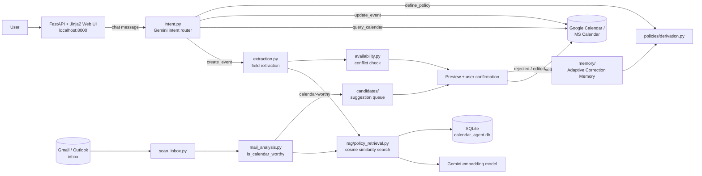

# Calendar Agent

> **Multilingual RAG calendar assistant, powered by Google Gemini.**
> A personal email and calendar assistant with a Web UI, natural-language rules, and mandatory confirmation before every calendar write.

[](#)
[](#)
[](src/ui/app.py)
[](#)
[](tests/)

## Project Demo

[](https://drive.google.com/file/d/1iKlYbIsNttIPag3yzwIgQzejOuc7iOQQ/view?usp=drive_link)

> Walkthrough video — sign-in, conversational event creation with conflict detection, mail-derived suggestions, and Adaptive Correction Memory in action.

---

## What is Calendar Agent?

**Calendar Agent** is a personal Retrieval-Augmented Generation (RAG) assistant for email and calendar management. It lets you talk to your calendar in plain language — Turkish, English, or a mix of both — create events, ask what's on your schedule, define personal rules ("meetings default to 60 minutes"), and scan your Gmail/Outlook inbox for calendar-worthy content, all reviewed and confirmed by you before anything is written.

**Every write needs your explicit approval — nothing is ever added to your calendar silently.**

Chat inference, intent classification, field extraction, and rule retrieval run through Google's **Gemini API** — `gemini-3.5-flash-lite` for chat/intent/extraction and `gemini-embedding-001` for the RAG retrieval that matches your messages against your own rules. Gemini also powers multimodal features: extracting events from a photo/PDF and transcribing voice messages. The project also ships a fully local, offline inference path via **Microsoft Foundry Local** as an alternative backend for anyone who wants zero cloud dependency (see `LLM_PROVIDER` in `.env.example`).

> Built as a personal project around the **Microsoft Foundry Local Summer School** brief (see `docs/Summer School Foundry Local Plan.pdf` and `docs/architecture-plan.md`).

---

## Screenshots

### Home


*Today's events, pending suggestions, and the chat assistant — all on one screen.*

### Calendar


*Weekly hourly grid with overlap-aware layout and a mini month picker.*

### Suggestions


*Calendar-worthy content extracted from Gmail/Outlook, queued for review — nothing is added without approval.*

### My Rules


*Personal rules defined in natural language, applied automatically via RAG retrieval on future events.*

---

## Architecture



**Conversational create_event flow:**

1. A chat message (web chatbox or CLI) reaches `intent.py`, which classifies it into `create_event` / `query_calendar` / `update_event` / `define_policy` / `other` using Gemini.
2. `create_event` runs through `extraction.py`, filling in title/time/duration/importance from the message.
3. Active personal rules are retrieved by cosine similarity over Gemini embeddings (`rag/policy_retrieval.py`) and applied deterministically to any still-missing fields — the LLM never decides *which* rule applies, retrieval does, and the rule engine applies it.
4. `availability.py` checks the target slot against the calendar and proposes alternatives on conflict.
5. The candidate is shown as a preview; nothing is written until the user approves.
6. A rejection (with a reason) or a manual field edit can be captured by **Adaptive Correction Memory** and, only with explicit confirmation, turned into a new personal rule for next time.

Mail scanning (`scan_inbox.py`) follows a parallel path: each new message is classified as calendar-worthy or not (reusing the same rule retrieval for field defaults), and worthy candidates land in the same suggestion queue and preview/confirm step as chat-created events.

---

## Features

### Core Intelligence

**Intent Routing** — a Gemini classifier routes every message into `create_event`, `query_calendar`, `update_event`, or `define_policy`, so a scheduling question is never mistakenly treated as an event-creation request.

**Deterministic Rule Engine** — personal rules ("exams get a reminder 3 days before") are retrieved by embedding similarity but *applied* by plain code, not the LLM — the model never gets to guess which rule wins; sender-scoped and event-type-scoped rules are filtered before ranking to avoid cross-contamination between unrelated candidates.

**Adaptive Correction Memory** — rejecting a suggestion (with a reason) or editing a field before approving can become a new rule, but only after you explicitly confirm "apply this in the future too?" — no silent learning.

**Conflict Detection** — every candidate is checked against the calendar's freebusy data before confirmation, with alternative time slots suggested automatically when the requested slot is busy.

### Mail & Document Processing

**Gmail + Outlook scanning** — both providers are scanned through a shared, provider-agnostic pipeline (`UnifiedEmail`); Gmail's own Promotions/Social labels are used as a deterministic pre-filter before the LLM ever sees a message.

**Multimodal extraction** — a photo or PDF (invitation, ticket, itinerary) can be uploaded in chat and yield multiple extracted events in one pass, each confirmed individually; the same mechanism transcribes voice messages to text.

**Minimum-retention mail handling** — mail body is never stored beyond a 2000-character excerpt; attachment bytes used for multimodal extraction are processed in memory and discarded immediately, never written to disk.

### Multi-Account & Multi-User

**Real sign-in** — Gmail or Outlook OAuth only, no passwords stored; one or more mail accounts can be connected under a single identity, with one designated as the "main" calendar account that all writes target regardless of which account is active in the UI.

**Per-user isolation** — rules, corrections, and suggestions are scoped to the logged-in user; a second person signing in starts from a genuinely empty state, not the first user's data.

### Security & Privacy

**Minimum-retention by design** — mail body is capped at a short excerpt and never stored in full (see below); a fully local/offline inference path is also available for anyone who'd rather not use a cloud LLM at all.

**OAuth done carefully** — PKCE-secured Google authorization code flow, minimal requested scopes (`gmail.readonly`, `calendar.events`, `calendar.readonly`), Microsoft PKCE via MSAL public client (no client secret), tokens stored locally under `data/` (gitignored) — never in the repo, never transmitted elsewhere.

**Mandatory confirmation** — there is no code path that writes to a calendar without a rendered preview and an explicit user approval first.

**CSRF-guarded sessions** — cross-site POSTs are rejected via `Sec-Fetch-Site`/`Origin` checks; sessions are DB-backed opaque tokens, not client-decodable JWTs.

### Developer Experience

**Web Chatbox with AJAX fragments** — the assistant chat updates in place without a full page reload, degrades gracefully to a normal redirect flow if JavaScript is unavailable.

**Debug logging** — every LLM call's raw input/output and every decision point is logged to `data/debug.log`, so an unexpected result can be traced without guessing.

**pytest suite** — 478 deterministic tests (services, stores, RAG retrieval, full route-level Web UI tests via `TestClient`) with zero real LLM/network calls — every provider is a controllable fake implementing the real interface.

---

## Tech Stack

### Web UI

| Technology | Purpose |
|---|---|
| FastAPI | Application framework, routing, middleware |
| Jinja2 | Server-rendered templates (no SPA/build step) |
| Vanilla JS (fetch) | AJAX chat fragment updates, mic/file upload |
| Leaflet (self-hosted) | Location picker map on the event edit form |
| Hand-written CSS design system | Tokens + components, light/dark theme, no framework |

### Backend / Core

| Technology | Purpose |
|---|---|
| Python 3.11+ | Runtime |
| Pydantic v2 | Domain models, validation |
| SQLite | Single-file storage — events, policies, corrections, sessions, embeddings |
| google-api-python-client / google-auth-oauthlib | Gmail + Google Calendar access |
| msal | Outlook mail + MS Calendar access (Microsoft Graph) |
| requests | Microsoft Graph HTTP calls |

### Inference & Storage

| Component | Technology |
|---|---|
| Inference provider | Google Gemini API |
| Chat model | `gemini-3.5-flash-lite` |
| Embedding model | `gemini-embedding-001` (768-dim) |
| Multimodal input | Gemini's native file input — photos, PDFs, and voice messages |
| Vector storage | SQLite — FP32 BLOB embedding columns, brute-force cosine search |
| Database | `data/calendar_agent.db` (local file, gitignored) |
| Alternative backend | Microsoft Foundry Local — fully local/offline inference (`qwen3-4b` + `qwen3-embedding-0.6b`); used when `LLM_PROVIDER=gemini` is not set |

---

## Directory Structure

```
calender-agent/
│
├── README.md
├── CLAUDE.md                        # Full project context / live-testing findings
├── requirements.txt
├── .env.example
│
├── src/
│   ├── core/                        # Pydantic domain models + logging_config.py
│   ├── providers/                   # LLM/Embedding provider abstraction
│   │   ├── foundry_local.py         # Local inference (chat + embedding)
│   │   ├── gemini.py                # Optional cloud backend (multimodal input)
│   │   └── json_generation.py       # Shared JSON-output retry/cleanup
│   │
│   ├── connectors/                  # Gmail, Outlook, Google Calendar, MS Calendar, OAuth
│   │   ├── gmail.py / outlook.py
│   │   ├── google_calendar.py / ms_calendar.py
│   │   ├── google_auth.py / microsoft_auth.py
│   │   └── account_registry.py
│   │
│   ├── services/                    # Conversation & orchestration layer
│   │   ├── intent.py                # create_event / query / update / define_policy
│   │   ├── extraction.py            # Shared field extraction
│   │   ├── availability.py          # Conflict engine
│   │   ├── mail_sync.py / mail_analysis.py
│   │   ├── vertical_prototype.py    # CLI conversational flow
│   │   ├── chat_flow.py             # Web Chatbox state machine
│   │   └── scan_inbox.py            # Shared by CLI and "scan now" button
│   │
│   ├── candidates/                  # Suggestion queue persistence
│   ├── policies/                    # Personal rules — CRUD + NL derivation
│   ├── memory/                      # Adaptive Correction Memory
│   ├── rag/                         # Embedding-based policy/correction retrieval
│   ├── storage/                     # SQLite schema + migrations
│   ├── localization/                # TR/EN string table + date/time formatting
│   │
│   └── ui/                          # FastAPI + Jinja2 Web UI
│       ├── app.py                   # Middleware stack, lifespan, router mounting
│       ├── auth.py / auth_routes.py # Sign-in, sessions
│       ├── oauth_routes.py / outlook_oauth_routes.py
│       ├── routes.py                # The 8 main screens
│       ├── chat_routes.py / chat_state.py
│       ├── templates/               # Jinja2 templates
│       └── static/                  # CSS design system, logos, Leaflet assets
│
├── tests/                           # pytest — 478 tests, fully isolated (temp_db fixture)
│
├── data/                            # SQLite DB, OAuth tokens, debug.log — NOT in git
│
└── docs/
    ├── architecture-plan.md         # Full architecture & design decisions
    ├── Summer School Foundry Local Plan.pdf
    └── screenshots/                 # UI captures for this README
```

---

## Setup & Usage

### Prerequisites

- **Python 3.11+**
- Git
- A Google account (Gmail + Google Calendar read/write access)
- A Gemini API key (free tier) — get one at [aistudio.google.com/apikey](https://aistudio.google.com/apikey)

### 1 — Clone and set up a virtual environment

```bash
git clone <repo-url>
cd calender-agent

python -m venv .venv
# Windows: .venv\Scripts\Activate.ps1
# macOS/Linux: source .venv/bin/activate

pip install --upgrade pip
pip install -r requirements.txt
```

### 2 — Configure the Gemini API key

Copy `.env.example` to `.env` and set:

```
LLM_PROVIDER=gemini
GOOGLE_API_KEY=<your key from aistudio.google.com/apikey>
```

### 3 — Google OAuth (Gmail + Calendar)

1. [console.cloud.google.com](https://console.cloud.google.com) → new project → enable `Gmail API` and `Google Calendar API`
2. OAuth consent screen → External → add your own Gmail as a **Test user**
3. Add scopes: `gmail.readonly`, `calendar.events`, `calendar.readonly`
4. Create an OAuth client (type **Desktop app**), download the JSON, save it at `data/google_oauth_client.json`

> Refresh tokens expire after 7 days while the app is unverified ("Testing" mode) — the app detects this and re-prompts automatically, no need to redo setup.

### 4 — (Optional) Outlook/Microsoft accounts

Azure App Registration under a **personal** Microsoft account → "Personal Microsoft accounts only" → add a "Mobile and desktop applications" platform with redirect URI `http://localhost` → grant `Mail.Read`, `Calendars.ReadWrite`, `offline_access`, `User.Read` → set `MS_CLIENT_ID` in `.env` (see `.env.example`). No client secret needed.

### 5 — Run

```bash
# Web UI (recommended)
python -m src.ui.app   # http://127.0.0.1:8000/

# CLI alternatives
python -m src.services.vertical_prototype   # conversational event creation / calendar queries
python -m src.services.scan_inbox           # scan the inbox (confirmation happens on the web)
```

First run opens a browser tab for Google/Outlook sign-in — this only happens once. (If `GOOGLE_API_KEY` isn't set, the app falls back to its local Foundry Local backend instead, downloading a small local model on first run.)

### 6 — Run the tests

```bash
pytest tests/
```

---

## Security & Privacy

| Control | Implementation |
|---|---|
| **Minimal LLM exposure** | Only the message text (and, for scanned mail, a capped excerpt) is sent to the Gemini API for a given turn — never the full mailbox, calendar, or account credentials. |
| **Minimum-retention mail handling** | Mail body capped at a 2000-character excerpt (`BODY_EXCERPT_MAX_CHARS`); attachment bytes for multimodal extraction are processed in memory and never written to disk. |
| **OAuth done carefully** | PKCE-secured Google authorization code flow; Microsoft PKCE via MSAL public client (no client secret); minimal scopes requested on both providers. |
| **Local token storage** | OAuth tokens live under `data/` (gitignored) — never committed, never sent anywhere but the provider's own token endpoint. |
| **Mandatory write confirmation** | No code path writes to a calendar without a rendered preview and explicit user approval. |
| **CSRF protection** | `CSRFGuardMiddleware` rejects cross-site POSTs via `Sec-Fetch-Site`/`Origin` checks. |
| **DB-backed sessions** | Opaque session tokens, not client-decodable JWTs; sign-in is Gmail/Outlook OAuth only — no passwords stored anywhere. |
| **Per-user data isolation** | Personal rules, corrections, and suggestions are scoped to the logged-in user; account ownership can only be reassigned by a fresh OAuth consent. |

---

## Screens & Routes

| Screen | Route | Description |
|---|---|---|
| Sign in | `GET /giris` | Gmail/Outlook sign-in |
| Home | `GET /anasayfa` | Today's events, pending suggestions, chat assistant |
| Calendar | `GET /takvim` | Weekly hourly grid view |
| Suggestions | `GET /oneriler` | Mail-derived calendar candidates awaiting review |
| My Rules | `GET /kurallarim` | Natural-language personal rules |
| My Corrections | `GET /duzeltmelerim` | Adaptive Correction Memory history |
| Email Accounts | `GET /hesaplar` | Connect/manage Gmail & Outlook accounts, trigger a scan |
| Settings | `GET /ayarlar` | Language, theme, timezone, main calendar account |
| Assistant chat | `POST /asistan/mesaj` | One chat turn — create/query/update an event or define a rule |

> Route paths are intentionally kept in Turkish (e.g. `/oneriler`, `/kurallarim`) — only the on-screen labels are localized. Auto-generated interactive API docs are available at `http://127.0.0.1:8000/docs`.

---

## Attribution

Built as a personal project around the **Microsoft Foundry Local Summer School** brief (`docs/Summer School Foundry Local Plan.pdf`). Inference powered by the **Google Gemini API**, with **[Microsoft Foundry Local](https://github.com/microsoft/foundry-local)** available as a fully local alternative backend.

No license file is currently included — treat this repository as all-rights-reserved by the author unless a `LICENSE` file is added.
