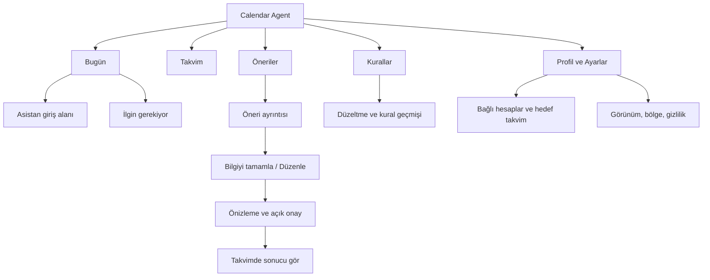

**Calendar Agent — Ürünleşme ve tasarım yol haritası**

İnceleme tarihi: 9 Eylül 2026. Bu belge mevcut kaynak kodu, çalıştırma denemesi, test sonuçları ve depodaki ekran görüntüleri üzerinden hazırlanmıştır. Süreler ve başarı hedefleri planlama önerisidir; ölçülmüş ürün performansı veya kesin teslim taahhüdü değildir.

**Karar özeti**

Proje, çalışan ve kapsamlı bir kişisel asistan prototipi seviyesinde. E-postadan etkinlik önerisi çıkarma, doğal dille takvim işlemleri, kullanıcı onayı, çoklu hesap, kişisel kurallar ve düzeltme hafızası ürünün çekirdeğini oluşturuyor. Ürünleşme için öncelik; bu çekirdeği güvenilir, kolay anlaşılır ve işletilebilir hale getirmek.

Önerilen ürün vaadi: **“E-postalarındaki planları yakala, takvimine eklemeden önce birlikte netleştirelim.”**

İlk hedef olarak bireysel kullanım için davetli web beta öneriyorum. İlk kullanıcı grubunu, kişisel Gmail kullanan ve haftada çok sayıda tarihli e-posta alan öğrenciler, araştırmacılar veya bağımsız çalışanlar arasından görüşmelerle seçmeliyiz. Bu henüz doğrulanmış bir pazar seçimi değil. Kurumsal Microsoft 365 desteği ayrı bir kapsam kararı gerektiriyor.

İlk sürümün başarı ölçüsü özellik sayısı değil; kullanıcının doğru bir öneriyi kısa sürede güvenle takvimine ekleyebilmesi ve sonraki hafta tekrar gelmesi olmalı. Mevcut FastAPI, Jinja2 ve CSS sistemi bu aşamayı taşıyabilir. Tasarım yenilemesi için tüm uygulamayı yeniden yazmak gerekmiyor.

**İncelemenin kapsamı ve doğrulama sınırları**

| İnceleme | Sonuç |
|---|---|
| `.venv\Scripts\python.exe -m src.ui.app` | Başarılı; uygulama `http://127.0.0.1:8000` üzerinde açıldı. |
| Canlı HTTP kontrolü | `/giris`: 200; oturumsuz `/anasayfa`: 303 ile `/giris` yönlendirmesi. |
| Standart test komutu | 467 başarılı, 11 başarısız; başarısız sohbet rotası testleri gerçek Google OAuth token yenilemesine ulaşıyor ve ağ kısıtında hata alıyor. |
| İzole test deneyi | Google ve Microsoft auth modüllerindeki `DATA_DIR`, yalnızca test süreci boyunca geçici klasöre yönlendirilince 478 başarılı, 13 kullanım dışı kalacak API uyarısı; 22,83 saniye. Kalıcı kod düzeltmesi yapılmadı. |
| Yetkilendirme deneyi | Geçici SQLite veritabanında iki kullanıcı oluşturuldu. Başka kullanıcıya ait önerinin düzenleme GET isteği 200 döndü; POST isteği 303 döndü ve başlık gerçekten değişti. Gerçek hesaplarda işlem yapılmadı. |
| Görsel inceleme | `docs/screenshots` içindeki ana sayfa, takvim, öneriler ve kurallar ekranları görüntülendi; güncel şablon/CSS ile karşılaştırıldı. |
| Doğrulanmayanlar | Giriş sonrası canlı tarayıcı kullanımı, gerçek OAuth girişinin tamamlanması, gerçek takvime yazma, gerçek LLM kalitesi, mobil etkileşim, yük ve erişilebilirlik ölçümleri. |

Ekran görüntüleri önceki bir sürümden olabilir. Görsel bulgular bu nedenle canlı etkileşim testi olarak değerlendirilmemeli. Bu rapor tam kapsamlı sızma testi veya hukuki uygunluk denetimi değildir. Uygulama başlangıcı normal veritabanı başlatma ve loglama mekanizmasını çalıştırdı. İnceleme sırasında üretim kodu değiştirilmedi; önceden mevcut `.gitignore` değişikliği korundu.

**Korunması gereken güçlü taraflar**

| Mevcut temel | Üründeki değeri | Kaynak |
|---|---|---|
| LLM ve connector arayüzleri | Model ve sağlayıcı değişimini sınırlar; servisleri arayüzden ayırır. | [providers/base.py](../src/providers/base.py), [connectors/base.py](../src/connectors/base.py) |
| Onay öncesi öneri ve çakışma kontrolü | Kullanıcı kontrolünü ürünün merkezine koyar. | [chat_flow.py](../src/services/chat_flow.py), [routes.py](../src/ui/routes.py), [availability.py](../src/services/availability.py) |
| Kural ve düzeltme hafızası | Kullanıcıya zamanla daha uygun öneriler üretebilmek için farklılaşma alanı. | [policy_retrieval.py](../src/rag/policy_retrieval.py), [correction_memory.py](../src/memory/correction_memory.py) |
| Türkçe/İngilizce altyapısı | İki dil için ortak ürün geliştirmeyi kolaylaştırır. | [localization](../src/localization/) |
| Tasarım token’ları ve ortak kart makrosu | Ekranları aşamalı ve tutarlı yenilemeyi mümkün kılar. | [tokens.css](../src/ui/static/tokens.css), [_candidate_card.html](../src/ui/templates/macros/_candidate_card.html) |
| 478 testlik mevcut kapsam | Yeniden tasarım ve güvenilirlik çalışmalarında regresyon zemini sağlar. | [tests](../tests/) |
| SQLite WAL, foreign key ve mevcut audit kayıtları | Yerel prototip için düşünülmüş veri bütünlüğü temeli. | [db.py](../src/storage/db.py), [schema.sql](../src/storage/schema.sql) |

**Yayından önce çözülmesi gerekenler**

P0: dış kullanıcılı beta öncesi. P1: kullanılabilir ve sürdürülebilir beta için. P2: kullanım verisiyle değer kanıtlandıktan sonra.

| Kimlik / öncelik | Bulgu ve etkisi | Yapılacak iş | Tamamlanma ölçütü |
|---|---|---|---|
| AUTH-01 / P0 | Başka kullanıcıya ait öneri, ID bilindiğinde okunup düzenlenebiliyor. Geçici veritabanında doğrulandı. | Öneri okuma/düzenleme/onaylama/reddetme işlemlerini oturum kullanıcısının hesaplarına zorunlu bağla; ortak servis/repository kontrolü kullan. | A kullanıcısı B’nin önerisine GET/POST yaptığında 403/404; veri ve dış sağlayıcı çağrısı değişmiyor. Tüm ilgili rotalarda negatif test. |
| AUTH-02 / P0 | Hesap listesi `user_id IS NULL` kayıtlarını da gösteriyor; ilk girişte sahipsiz verilerin devralınması mevcut yerel kullanım varsayımı. | Sunucu modunda sahipsiz kayıtları dışla; eski verileri açık sahiplik eşlemesiyle taşı. Hesap kimliğini sağlayıcı ve değişmez sağlayıcı kimliğiyle eşleştir. | İki kullanıcılı testte sahipsiz/eski kayıtlar görünmez; aynı adres öneki farklı sağlayıcılarda çakışmaz. |
| PRIV-01 / P0 | Google token’ları JSON, Microsoft cache’i metin dosyası olarak yazılıyor. Ham model girdisi/çıktısı DEBUG loglarına girebiliyor. | Sunucu için şifreli token deposu ve ayrı anahtar yönetimi; yerel dağıtım için işletim sistemi güvenli deposu. Varsayılan loglarda içerik maskeleme, rotasyon ve saklama süresi. | Token, e-posta gövdesi ve hassas sohbet içeriği normal loglarda yok; silme ve erişim kontrolleri doğrulanıyor. |
| AUTH-03 / P0 | Oturum ömrü 400 gün; OAuth callback oturum çerezinde `Secure` yok. CSRF kontrolü başlıklar olmadığında isteği kabul ediyor ve yalnızca POST için çalışıyor. | HTTPS/proxy/izinli host ayarları, üretim çerez profili, daha kısa ve yenilenebilir oturum politikası, tüm yazma yöntemlerini kapsayan CSRF stratejisi. | Üretim konfigürasyon testleri; oturum iptali ve çapraz kaynaklı istek senaryoları geçiyor. |
| WRITE-01 / P0 | Öneri onayında sağlayıcıya yazma ile DB durum güncellemesi ayrı; kalıcı işlem anahtarı yok. Bellekteki sohbet/tarama setleri süreçler arası koruma sağlamaz. | Atomik işlem talebi, kalıcı idempotency anahtarı, sağlayıcı sonucunu uzlaştırma ve tekrar deneme tasarımı. | Çift tıklama, iki sekme, iki worker ve “sağlayıcı yazdı ama yanıt kayboldu” deneyinde tek etkinlik oluşuyor. Bu risk koddan çıkarıldı; canlı mükerrer kayıt üretilmedi. |
| EVENT-01 / P0 | Hatırlatıcılar model/önizlemede mevcut; connector yazma sözleşmesi başlık, başlangıç, bitiş ve konumla sınırlı. | Önizleme ile yazılan alanları eşleştir; desteklenen hatırlatıcıları sağlayıcıya aktar, desteklenmeyen alanı açıkça göster. | “3 gün önce hatırlat” kuralı sağlayıcıdan geri okunduğunda doğrulanıyor. Google ve Microsoft yetenek farkları görünür. |
| TEST-01 / P0 | Testler yerel OAuth token dosyasına ulaşabiliyor. | Token dizinleri, DB, ortam değişkenleri ve ağ erişimi için kalıcı izolasyon; birim/route testlerinde varsayılan dış ağ yasağı. | Standart test komutu temiz kurulumda ve gerçek `.env` bulunan geliştirme makinesinde 478/478; gerçek kimlik bilgisi kullanılmıyor. |
| OAUTH-01 / P0 | Localhost ve desktop OAuth varsayımları sunucuya taşınamaz; Gmail okuma kapsamı doğrulama gereksinimi doğuruyor. | Dağıtım modelini seç; web callback/domain yapılandırması, izin ekranı, gizlilik sayfası ve sağlayıcı doğrulamasını erken başlat. | Seçilen kullanıcı kitlesi üretim giriş akışını tamamlıyor; uygulanabilir sağlayıcı koşulları karşılanıyor. |
| JOB-01 / P1 | E-posta taraması senkron ve uzun sürüyor; koruma bellek içi. | Kalıcı iş kuyruğu/worker, iş durumu, checkpoint, hesap başına kilit, kontrollü tekrar deneme ve zaman aşımı. | Sayfa kapansa veya worker yeniden başlasa tarama durumu korunuyor; kullanıcı ilerleme ve hata nedenini görüyor. |
| INPUT-01 / P0 | Dosya ve ses yükleme rotaları `.file.read()` ile tamamını okuyor; bu rotalarda açık ürün boyut sınırı görülmedi. | İstek/dosya/ses süresi sınırları, gerçek dosya türü doğrulama, kullanıcı kotası ve hata mesajları. | Fazla büyük/uyumsuz içerik LLM çağrısından önce reddediliyor; bellek ve ücret sınırı korunuyor. |
| OPS-01 / P1 | İncelenen depoda CI workflow, sürüm kilidi ve deployment paketi görülmedi; gereksinimler büyük ölçüde sürümsüz. | Kilitli bağımlılıklar, CI, staging, migration sürümleri, health/readiness, yedekleme ve geri yükleme prosedürü. | Temiz makinede tekrarlanabilir kurulum; staging’den doğrulanmış sürüm; yedekten geri dönüş tatbikatı. |

Yetkilendirme kanıtının kod noktaları: [routes.py](../src/ui/routes.py) içindeki `edit_form`, `edit_submit`, `approve`, `reject`; [store.py](../src/candidates/store.py) içindeki yalnızca candidate ID ile sorgulayan `get_pending_candidate`. Düzenleme POST fonksiyonu `Request` bile almıyor. Listeleme sırasında kapsam uygulamak, tek kayıt rotalarını korumuyor.

Diğer dayanaklar: [account_registry.py](../src/connectors/account_registry.py), [auth.py](../src/ui/auth.py), [security.py](../src/ui/security.py), [oauth_routes.py](../src/ui/oauth_routes.py), [google_auth.py](../src/connectors/google_auth.py), [microsoft_auth.py](../src/connectors/microsoft_auth.py), [logging_config.py](../src/core/logging_config.py), [json_generation.py](../src/providers/json_generation.py), [chat_routes.py](../src/ui/chat_routes.py), [google_calendar.py](../src/connectors/google_calendar.py), [ms_calendar.py](../src/connectors/ms_calendar.py).

E-posta gövdesinin DB’de 2.000 karakterle sınırlandırılması olumlu; bu tek başına tüm sistemin az veri tuttuğunu kanıtlamaz. Sohbet geçmişi, öneriler, dosya işleme ve loglar birlikte ele alınmalı. Hesap bağlantısını kesme, erişimi iptal etme, verileri dışa aktarma, hesap silme ve yedeklerde silinen verinin ömrü ayrı ürün akışları olarak tanımlanmalı.

Gmail `gmail.readonly` kapsamı restricted olarak sınıflandırılıyor. Sunucuda bu kapsamdaki verilerin saklanması veya aktarılması, uygulanabilir istisnalara bağlı olarak güvenlik değerlendirmesi gerektirebilir. Doğrulama süresi ve maliyeti geliştirme sprintinden ayrı dış bağımlılık olarak yönetilmeli. [Google kapsamları](https://developers.google.com/workspace/gmail/api/auth/scopes), [restricted scope doğrulaması](https://developers.google.com/identity/protocols/oauth2/production-readiness/restricted-scope-verification).

Microsoft connector’ında authority `consumers`; bu nedenle mevcut Outlook desteğini iş/okul hesabı desteği gibi pazarlamamalıyız. Bu kitle hedeflenirse app registration, tenant izinleri ve entegrasyon testleri genişletilmeli. [Microsoft hesap türleri](https://learn.microsoft.com/en-us/security/zero-trust/develop/identity-supported-account-types).

**İlk ürün kapsamı ve kullanıcı deneyimi**

İlk sürüm: hesap bağlama → hedef takvimi seçme → sınırlı bir e-posta aralığını tarama → öneriyi inceleme → eksik alanı tamamlama → açık onay → takvimde sonucu görme. Doğal dille etkinlik oluşturma aynı önizleme bileşenine bağlanmalı.

Onboarding’de önce ürünün faydası ve veriye neden erişildiği açıklanmalı. Ardından takvim bağlanmalı; e-posta taraması ayrı ve anlaşılır bir izin adımı olmalı. İlk değer deneyimi için gerçek posta kutusuna ihtiyaç duymayan, örnek verili bir deneme sunulmalı. Kullanıcının `.env`, API anahtarı veya terminal komutuyla uğraşması, genel web ürününde onboarding’in parçası olmamalı.

Onay kartında başlık, tam tarih/saat, saat dilimi, kaynak hesap, yazılacak hedef takvim, çakışma ve uygulanacak hatırlatıcı bulunmalı. Tarih veya saat belirsizse ana eylem “Bilgiyi tamamla” olmalı. Takvime yazmadan hemen önce çakışma ve güncelleme hedefi yeniden doğrulanmalı; kullanıcının onayladığı alanların sürümü işlem kaydına bağlanmalı.

Güncelleme önerisinde önceki ve yeni zaman birlikte gösterilmeli. Sonuç başarılı olduğunda “Takvime eklendi” mesajı, etkinliğe bağlantı ve hedef hesap görünmeli. Geri alma, gerçekten uygulanabilen sağlayıcı işlemiyle ve başarısızlık durumu tanımlanarak eklenmeli.

Tarih/saat kapsamı ayrıca netleştirilmeli: tüm gün etkinliği, tekrar eden etkinlik, yaz saati geçişi, farklı hesap saat dilimleri, iptal edilen/ertelenen toplantı ve sağlayıcıda silinmiş etkinlik. [timeutil.py](../src/services/timeutil.py) ve connector’larda varsayılan İstanbul saat dilimi bulunuyor; mevcut bölge tercihlerinin uçtan uca tüm yazmalara etkisi test edilmeli.

İlk sürümde ekip yönetimi, otomatik onaysız planlama, ayrı native mobil uygulamalar, çok sayıda yeni connector ve gelişmiş seyahat planlama kapsam dışında tutulabilir. Ses/PDF özellikleri mevcut olsa da güvenilirlik ve maliyet ölçülene kadar ikincil veya deneysel sunulabilir.

**Mevcut tasarımın değerlendirmesi**

| Ekran | Gözlenen durum | Önerilen değişim |
|---|---|---|
| Ana sayfa | Büyük ekranın sağında geniş boşluk; gündem, üç sayaç ve sohbet dikey yığılıyor. | Esnek içerik alanında gündem ve “İlgin gerekiyor” bölümü; asistan girişini ana eylem yap. Sayaçları kısa özet satırına indir. |
| Takvim | Yoğun mavi etkinlik blokları, ikinci mini takvim ve çok sayıda tarih kontrolü. | Tek araç çubuğu, sakin ızgara, hesap rengi için ince vurgu; isteğe bağlı mini takvim ve etkinlik detay paneli. |
| Öneriler | Her kartta aynı uyarı, tüm düğmeler ve reddetme gerekçesi alanı aynı anda açık. Ham datetime çıktısı var. | Tarama kolaylığı sağlayan kompakt liste + seçili öneri paneli; gerekçe alanını reddetme sırasında aç. Tarihi yerelleştir. |
| Kurallar | Teknik etiketler, sürüm bilgisi ve dakika cinsinden değerler öne çıkıyor. | “Sınavlardan 3 gün önce hatırlat” gibi doğal dil; aktif/pasif anahtarı; teknik geçmişi ayrıntıya taşı. |
| Navigasyon | Yedi birincil bölüm; hesaplar, kurallar, düzeltmeler günlük işlerle aynı seviyede. | Dört ana bölüm; hesap ve tercihler profil altında. Düzeltmeleri kural geçmişiyle ilişkilendir. |
| Ayarlar | DB/log yolu ve sabit model adları normal ayarların içinde. | Görünüm, bölge, bağlantılar, gizlilik; teknik bilgiler destek/teşhis ayrıntısında ve gerçek runtime’dan. |

Ana sayfadaki boşluk güncel [base.css](../src/ui/static/base.css) dosyasında genel `.content` için `max-width: 900px` ile açıklanabiliyor. Uzun metin/formların dar tutulması yerinde; aynı genişlik kuralı tüm ürün ekranlarına uygulanmamalı. Ham tarih ve tüm eylemlerin birlikte gösterimi güncel [_candidate_card.html](../src/ui/templates/macros/_candidate_card.html) içinde de mevcut.

Mevcut sistemde karanlık/açık tema, mobil breakpoint, focus stili ve azaltılmış hareket desteği bulunuyor. Bunları sıfırdan eksik kabul etmek yerine yeni bileşenlerle birlikte koruyup tarayıcıda doğrulamalıyız.

**Apple yaklaşımından esinlenen tasarım yönü**

Hedef: sakin yüzeyler, güçlü tipografik hiyerarşi, az ama belirgin eylem, içerikle ilişkili detay panelleri ve öngörülebilir etkileşim. Apple’ın malzeme rehberi cam etkisinin kontrollü kullanılmasını, içerik ile kontrol katmanının ayrılmasını vurguluyor. Web uygulamasına uyarlarken yarı saydamlığı navigasyon veya açılır panel gibi sınırlı yüzeylerde değerlendirebiliriz. [Apple Materials](https://developer.apple.com/design/human-interface-guidelines/materials).

Aşağıdaki değerler bu ürün için başlangıç tasarım önerileridir; Apple’ın zorunlu ölçüleri veya erişilebilirlik sertifikası değildir.

| Tasarım kararı | Başlangıç önerisi |
|---|---|
| Renk | Açık zeminde `#F5F5F7`, ana yüzeyde beyaz, metinde `#1D1D1F`; koyu temada ayrı semantik karşılıklar. |
| Vurgu | Bir ana mavi; beyaz küçük metin taşıyan düğmelerde örneğin `#0066CC`, son palette kontrast ölçümü. Renk tek başına durum anlatmamalı. |
| Tipografi | `system-ui, -apple-system, BlinkMacSystemFont, "Segoe UI", sans-serif`; ana metin 16 px, ikincil bilgi 14 px, sayfa başlığı 28–32 px başlangıç ölçeği. |
| Boşluk | 4/8/12/16/24/32/48 ölçeği; içerik gruplarını boşluk ve ince ayırıcılarla ayır. |
| Köşe ve gölge | Kontrollerde 10–12 px, panellerde 16–20 px; gölgeyi yükselen katmanlarla sınırla. |
| Yerleşim | Masaüstünde yaklaşık 220 px kenar çubuğu; ana sayfada 1.100–1.200 px’e kadar esnek alan; takvimde kullanılabilir genişlik. |
| Hareket | Panel ve durum geçişlerinde 160–220 ms; `prefers-reduced-motion` altında hareketi azalt. |
| Kontroller | Mobilde yaklaşık 44×44 px rahat dokunma alanı; ikonlarda erişilebilir ad, klavyede görünür odak. |

Web hedefi WCAG 2.2 AA olmalı: normal metinde en az 4,5:1 kontrast, tam klavye kullanımı, okunabilir büyütme ve yeniden akış, görünür odak, ekran okuyucuya durum bildirimi. Otomatik tarama yanında manuel test gerekir. [W3C WCAG 2.2 hızlı başvuru](https://www.w3.org/WAI/WCAG22/quickref/).

**Önerilen bilgi mimarisi ve ekran akışları**

Masaüstünde dört ana bölüm solda; profil ve ayarlar altta. Mobilde aynı dört bölüm alt navigasyonda; profil üst köşede. Asistan her ekrandan erişilebilir bir giriş alanı veya düğmeyle açılmalı; tüm ekranlarda sürekli açık sohbet paneli zorunlu olmamalı.

**Bugün:** üstte “Bugün, 9 Eylül” ve kısa gündem özeti. Hemen altında “Yarın 14.00’e proje toplantısı ekle” örneğiyle asistan girişi. Sonra “Sıradaki” gündemi ve “İlgin gerekiyor” listesi. Geniş ekranda iki sütun, dar ekranda tek sütun. Aktif hesabın sayısı ile tüm hesapların öneri sayısı birbirine karışmamalı.

**Öneriler:** “Hazır”, “Bilgi gerekiyor”, “Güncelleme” filtreleri. Bir satırda etkinlik adı, okunabilir zaman, kaynak ve durum. Seçimde sağ detay paneli; mobilde erişilebilir tam ekran panel. Hazır kayıtta “Takvime ekle”, belirsiz kayıtta “Saati netleştir”. Kaynak e-posta alıntısı ve uygulanan kural açılabilir ayrıntıda.

**Takvim:** “Bugün”, önceki/sonraki, dönem başlığı ve gün/hafta görünümü tek araç çubuğunda. Mobil varsayılan gündem listesi olabilir. Etkinlik seçimi sayfa değiştirmeden detay açar. Sürükleyerek değiştirme ileriki aşamada eklenirse klavye/form alternatifi ve güncelleme önizlemesi de sunulmalı.

**Kurallar:** kısa doğal dil cümlesi, kapsam ve aktif anahtarı. “Bu kural ne zaman uygulandı?” ayrıntısı. Düzeltmeden öğrenilen davranış için mevcut açık onay korunmalı. “4320 dakika” kullanıcı yüzeyinde “3 gün önce” olmalı.

Her bileşenin boş, yükleniyor, eksik bilgi, bağlantı kesildi, hata ve başarı durumu tasarlanmalı. Örneğin “İşlem başarısız” yerine “Google bağlantın yenilenmeli. Önerin saklandı.”; gerçekten saklanmış olduğu durumda kullanılmalı.

**Yenilikçi ama sade üç özellik**

1. **Açıklanabilir öneri:** “Bu tarih davet e-postasından alındı; 30 dakika süresi toplantı kuralından geldi.” Ayrıntı isteğe bağlı açılır. Ölçülmemiş güven yüzdesi gösterilmez.
2. **Tek eksik bilgi sorusu:** “Toplantı saat kaçta?” Kullanıcı bütün düzenleme formunu doldurmadan ilerler; tamamlanan öneri yeniden önizlenir.
3. **Bağlama göre asistan:** Takvimde seçili gün ve ilgili hesap açıkça belirtilir; kullanıcı “Buraya 30 dakika odak zamanı ekle” diyebilir. Çıkarılan tarih ve hedef hesap onay kartında görünür.

Bu üç davranışın ilk ikisi beta için öncelikli; üçüncüsü çekirdek akış ölçüldükten sonra eklenebilir.

**Teknik dönüşüm yolu**

Önerilen yapı; mevcut servisleri koruyan modüler FastAPI uygulaması, ortak etkinlik önizleme bileşeni, ayrı tarama worker’ı ve kalıcı işlem/iş kayıtları. Çok kullanıcılı sunucu dağıtımı seçilirse PostgreSQL ve sürümlü migration planı hazırlanmalı; mevcut SQLite verisinin taşıma ve geri dönüşü test edilmeli. SQLite tek cihazlı yerel ürün için makul kalabilir.

İlk mimari kararda iki dağıtım yolu netleştirilmeli:

| Yol | Gereken yatırım | Uygun olduğu durum |
|---|---|---|
| Yerel masaüstü ürün | Kurulum paketi, imzalama/güncelleme, işletim sistemi token deposu, cihaz açıkken çalışma ve yedekleme deneyimi. | Yerel veri ve kişisel cihaz kullanımı temel satış vaadiyse. |
| Barındırılan web ürün — bu planın varsayımı | Web OAuth, kullanıcı izolasyonu, sunucu veri güvenliği, worker, operasyon ve sağlayıcı değerlendirmeleri. | Kurulumsuz erişim ve cihazlar arası kullanım öncelikliyse. |

Model çıkarımının yerel çalışması, Gmail/Outlook bağlantılarının da çevrimdışı olduğu anlamına gelmez. Pazarlama metninde bu ayrım doğru anlatılmalı.

Arayüz geçiş sırası: `tokens.css` → `base.css` ve navigasyon → ortak düğme/alan/durum/panel bileşenleri → öneri önizleme → Bugün → Öneriler → Takvim → Kurallar/Ayarlar. Sayfa içine dağılmış script’ler değiştirilen ekranlarla birlikte modüllere ayrılabilir. React/Next.js geçişi ancak karmaşık istemci durumu bunu gerektirirse yeniden değerlendirilmeli.

**12 haftalık önerilen yol haritası**

Varsayım: iki tam zamanlı geliştirici; haftada 2–3 gün ürün tasarımı/araştırması; gerektiğinde güvenlik ve operasyon desteği. Tek geliştiriciyle daha uzun takvim gerekir. Sağlayıcı onayları için bu süre garanti değildir. Fazlar takvim dolduğu için değil, çıkış ölçütleri karşılandığında tamamlanır.

| Dönem | İş ve sorumluluk | Teslimat / çıkış ölçütü | Bağımlılık |
|---|---|---|---|
| Hafta 1–2 | Backend: AUTH/PRIV/TEST riskleri. Ürün: 5–8 görüşme, hedef kitle ve dağıtım kararı. Tasarım: mevcut akış ve yeni bilgi mimarisi. | Sahiplik kontrolleri ve izolasyon testleri; öncelikli ürün kapsamı; veri akışı haritası; üç temel ekranın wireframe’i. | Başlangıç. OAuth gereksinimleri bu dönemde netleşir. |
| Hafta 3–4 | Backend: güvenilir yazma, hatırlatıcı sözleşmesi ve yükleme sınırları. Tasarım/frontend: token’lar, ortak önizleme, onboarding prototipi. | Çift işlem ve ağ kopması senaryoları; önizleme/yazma eşleşmesi; 5 kullanıcıyla ilk görev testi. | Sahiplik modeli ve ürün kapsamı. |
| Hafta 5–6 | Frontend: Bugün/Öneriler yeni tasarımı. Backend: kalıcı tarama işleri, gerekiyorsa DB taşıma ve web OAuth. | Yenilenen çekirdek akış staging’de; ilerleme/hata durumları; yeni kullanıcı ilk öneriyi tamamlıyor. | Tasarım bileşenleri, işlem altyapısı. |
| Hafta 7–8 | Frontend: Takvim/Kurallar/Ayarlar, mobil ve erişilebilirlik. Backend/ops: veri silme, log maskeleme, yedek ve dağıtım. | Uçtan uca tarayıcı testleri; masaüstü/mobil görev testi; geri yükleme denemesi; P0 açık madde yok. | Çekirdek akışın tamamlanması. |
| Hafta 9–10 | Ürün: koşullar uygunsa 20–30 davetli kullanıcı. Mühendislik: kalite, gecikme, maliyet ve hata takibi. | Haftalık kullanım ve öneri doğruluğu verisi; en büyük terk nedenlerinin düzeltilmesi. | Güvenlik/operasyon çıkış kapısı ve uygulanabilir sağlayıcı izinleri. |
| Hafta 11–12 | Ürün/ops: ücretli pilot hazırlığı, destek, paket/kota ve yayın kararı. | Devam eden kullanım kanıtı; maliyet ölçümü; destek prosedürü; go/no-go değerlendirmesi. | Beta bulguları. Genel yayın otomatik sonuç değildir. |

**İlk sprint için somut iş listesi**

| Sıra | İş | Kabul kriteri |
|---|---|---|
| 1 | `get_pending_candidate` ve mutation servislerine zorunlu kullanıcı kapsamı | Başka kullanıcı önerisinin okuma, düzenleme, onay ve reddi engelleniyor. |
| 2 | Sahipsiz veri davranışını sunucu modundan ayır | Giriş yapan kullanıcı eski sahipsiz hesapları otomatik görmüyor/devralmıyor. |
| 3 | Testlerde token dizini ve ağ izolasyonu | Ek wrapper gerektirmeden standart test komutu geçiyor. |
| 4 | Varsayılan içerik loglarını kapat/maskele | Sentetik hassas içerik normal loglarda görünmüyor. |
| 5 | Önizleme → connector alan sözleşmesini çıkar | Hatırlatıcı, tekrar, katılımcı ve hedef takvim desteği sağlayıcı bazında yazılı ve test edilebilir. |
| 6 | Bugün/Öneriler/Takvim wireframe ve bileşen durumları | Geniş/dar ekran ve boş/hata/belirsizlik durumları incelemeye hazır. |
| 7 | 5 kullanıcıyla “e-postadan etkinlik ekleme” görev testi | Süre, takılma noktası ve hedef takvim anlaşılabilirliği kaydediliyor. |

**Kalite, ölçüm ve yayın kapısı**

Mevcut test sayısı LLM kalitesini veya güvenli çok kullanıcılı kullanımı tek başına ölçmüyor. Sentetik veya izinli/anonimleştirilmiş 150–200 Türkçe/İngilizce örnekle küçük bir değerlendirme seti kurulmalı. Tarih/saat çıkarımı, etkinlik olmayan e-posta, ertelenme/iptal, bir belgede birden fazla etkinlik, çelişkili kurallar ve e-posta içindeki kötü niyetli model talimatları kapsanmalı. E-posta içeriği işlem yetkisi sayılmamalı; araç yazmaları her durumda uygulama politikası ve kullanıcı onayına bağlı kalmalı.

| Ölçüt | Önerilen ilk hedef | Nasıl ölçülecek? |
|---|---|---|
| Yetkisiz erişim | Hazırlanan çapraz kullanıcı matrisinde sıfır başarılı erişim | Entegrasyon testleri; özellikle doğrudan ID ile erişim. |
| Mükerrer yazma | Hata/tekrar deneme senaryolarında sıfır mükerrer etkinlik | Sağlayıcı sahte sunucusu ve ayrılmış entegrasyon hesabı. |
| Öneri doğruluğu | Etiketli sette öneri precision ≥ %90 başlangıç hedefi | Yanlış öneri oranıyla birlikte kaçırılan gerçek etkinlikleri de ölç. |
| Tarih/saat doğruluğu | Açık tarihli örneklerde ≥ %95 başlangıç hedefi | Belirsiz örneklerde soru sormayı ayrıca değerlendir. |
| İlk değer süresi | OAuth beklemesi hariç medyan < 3 dakika | İlk girişten ilk onaylı etkinliğe ürün analitiği. |
| Kullanılabilirlik | 5 kişilik testte en az 4 kişinin temel görevi yardımsız bitirmesi | Mobil ve masaüstü görev gözlemi; küçük örneklem olduğu belirtilir. |
| Devam eden kullanım | Aktive beta kullanıcılarında dördüncü hafta geri dönüşünü izle; ilk hipotez ≥ %30 | Kohort analizi; kısa sürede kesin pazar sonucu çıkarılmaz. |
| Maliyet | Kabul edilen öneri ve aktif kullanıcı başına maliyet biliniyor | Model token/çağrı, tarama, worker ve depolama kullanım metrikleri. |

İçerik taşımayan olaylar yeterli: `account_connected`, `scan_started`, `suggestion_created`, `suggestion_edited`, `suggestion_approved`, `calendar_write_succeeded/failed`. Analitiğe e-posta gövdesi veya etkinlik başlığı göndermemeliyiz.

Yayın kapısı: P0 bulguları kapalı; gizlilik ve veri silme akışı çalışıyor; sağlayıcı gereksinimleri karşılanmış; işlem kurtarma ve yedek geri yükleme denenmiş; kritik akışlar gerçek tarayıcıda doğrulanmış; hata uyarılarının ve destek başvurularının bir sorumlusu var. Bu inceleme mevcut sürüm için bu kapının geçildiğini göstermiyor.

**Ticari hazırlık ve kaynak ihtiyacı**

Beta öncesinde bir hedef kullanıcı, bir ana kullanım senaryosu, kısa tanıtım sayfası ve geri bildirim kanalı yeterli başlangıç sağlar. Kullanıcı görüşmelerinde “Beğendin mi?” yerine bugün e-postadan takvime nasıl geçtiği, neyi kaçırdığı, mevcut çözümün maliyeti ve hangi kullanım için ödeme yapacağı araştırılmalı.

Ücretli pilot öncesi tarama/ses/PDF kotaları, plan hakları, ödeme ve iptal deneyimi, destek kanalı ve kesinti iletişimi tanımlanmalı. Fiyatı tahmini model çağrısı üzerinden belirlemek yerine gerçek kullanım ve ödeme isteğiyle test etmeliyiz.

Aylık maliyet modeli: **barındırma + DB/yedek + worker + model/embedding + izleme + destek + uygulanabilir sağlayıcı değerlendirmeleri**. Model kullanımında kullanıcı başına taranan ileti sayısı × ileti başına çağrı sayısı × ölçülen token tüketimi ayrı takip edilmeli. Kodda tek bir kullanıcı eylemi birden fazla sınıflandırma/çıkarım çağrısı üretebildiği için maliyet varsayımı ölçülmeden fiyatlandırma yapılmamalı.

En yakın kararlar: yerel ürün mü web ürün mü; ilk kullanıcı kitlesi kim; ilk betada Gmail tek sağlayıcı mı, kişisel Outlook da desteklenecek mi; ekip kapasitesi ne. Bu rapor, çalışmayı durdurmamak için davetli web beta ve dar bir kişisel kullanım senaryosu varsayımıyla hazırlanmıştır.
